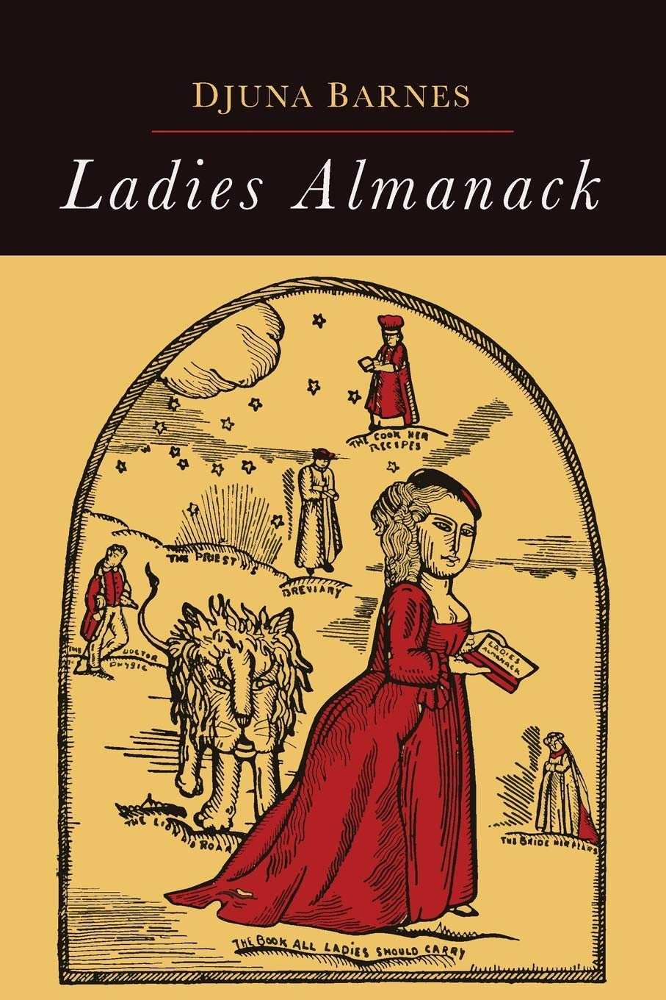

  

    <h5 class="card-title">A Key to the Ladies Almanack</h5>
    
Each character in the Ladies Almanack has a real world counterpart making the book a form of roman a clef. This form of writing, defined as ‘novel with a key’, is a piece of fiction where the subjects of the book are able to be identified by a reader who knows those people, typically a reader of a particular social group. In order to decode the novel, readers would also have to be in the know, or figure out the analogues as they went - we seek to provide that key so modern readers can gain a greater understanding of the Ladies Almanack.

  

    
  

    By: Nikita Saxena, Kevin Li, Abbey Esslinger, Davon Lewis
  

